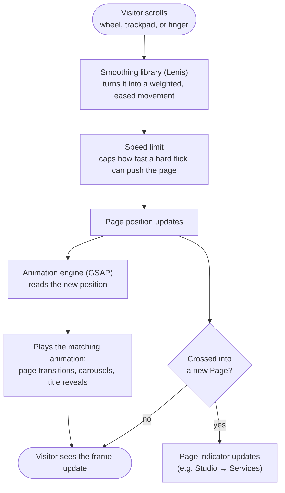

# How Scrolling Works — 8 Ball Studio

What happens when a visitor scrolls, from the wheel/finger to the page moving.

## In plain terms

1. **A scroll happens** — wheel, trackpad, or a finger swipe on a phone.
2. **It's smoothed** — raw scroll is jerky; a smoothing library (Lenis) turns it into a weighted,
   cinematic glide instead of a snap.
3. **Speed is capped** — a hard flick doesn't jump the page; there's a limit on how far ahead the
   target position can get.
4. **The animation engine watches position** — GSAP reads where the page is right now and scrubs
   every animation to match exactly (page transitions, the sideways carousels, titles fading in).
5. **The Page indicator updates** — once scrolling crosses into a new section (Studio, Services,
   etc.), the header highlight switches.

## Two special cases

- **One wheel notch = exactly one Page.** A hard, continuous scroll doesn't skip past two pages at
  once — each "gesture" only advances one step.
- **Going back up to Intro needs a deliberate swipe.** A small accidental scroll won't replay the
  opening pool-break animation; it takes a clear upward gesture.
