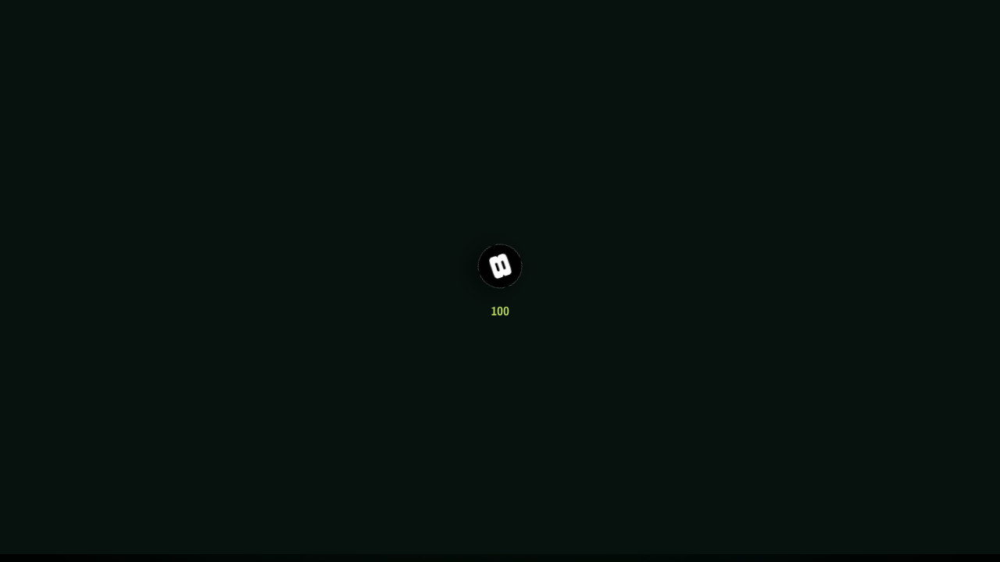
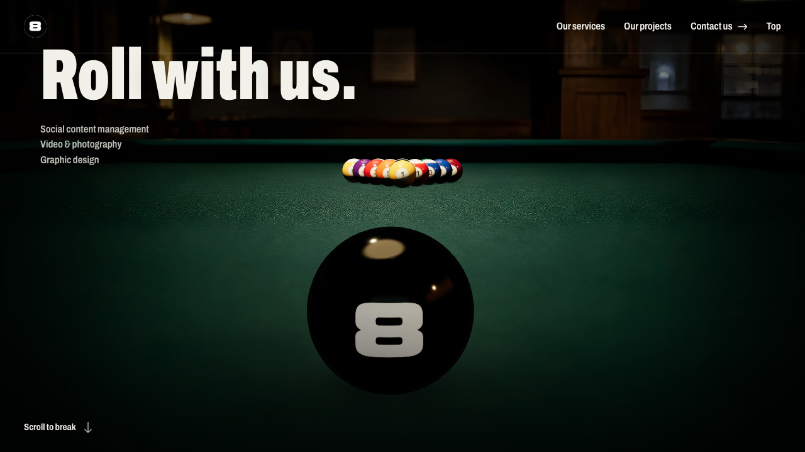
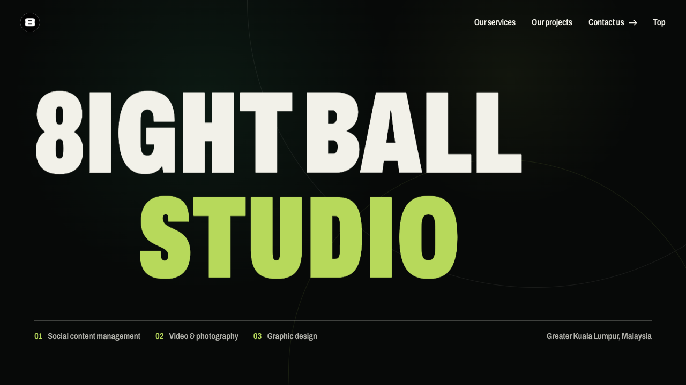
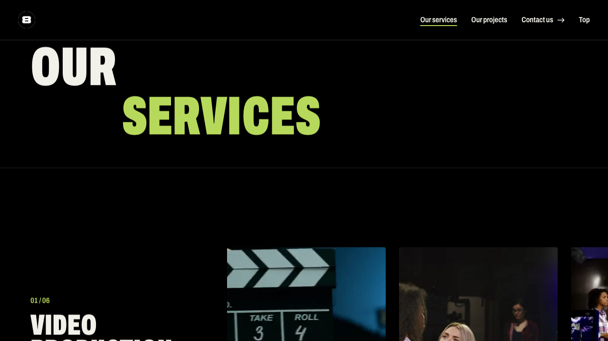
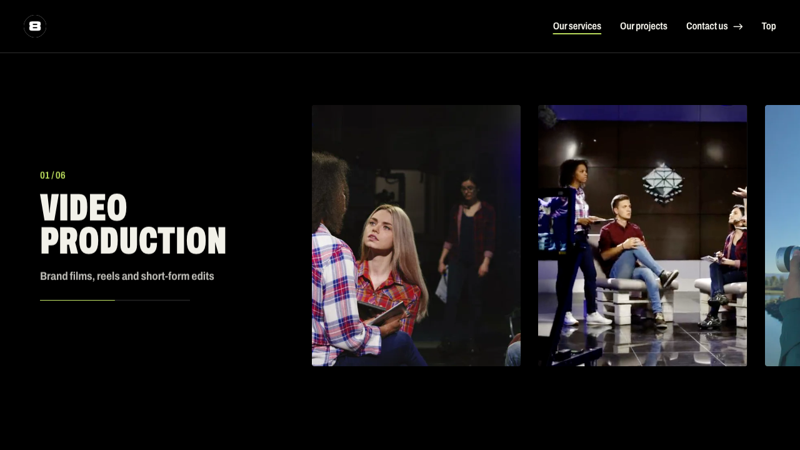
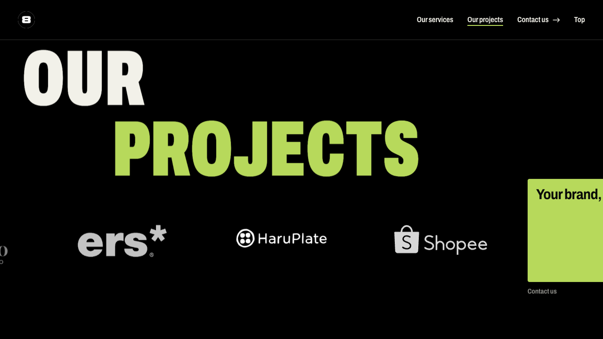
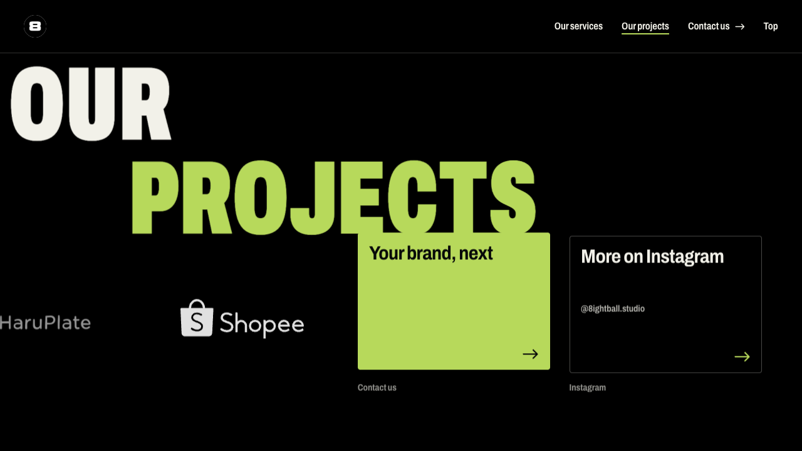
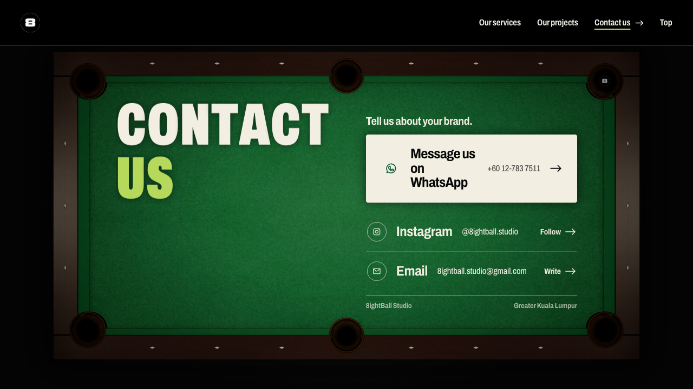
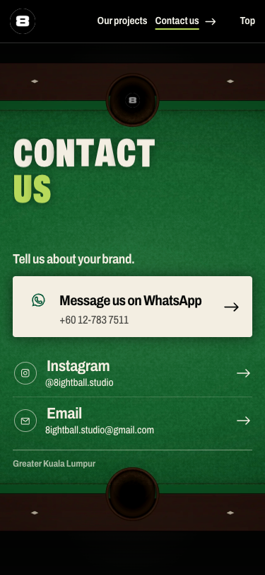

# 8ightBall Studio Website: Quick-Start Guide

A one-page guide to the studio's website for QA testers, product managers and business analysts. It shows what each screen is for, what a visitor can do there, and what to check.

Screenshots: live site, desktop at 1280 × 720 unless marked as phone, taken 2 Oct 2026 (commit `ac9d8a5`).

## Getting Started

### Accessing the site
- **Live:** https://8-ball-studio.vercel.app
- **Local (developers):** `npm run dev`, then the address Vite prints (for example http://localhost:5287)
- **Browsers:** Chrome, Safari, Firefox, Edge. The phone carousels are smoothest on Safari 26+ and Chrome 115+.
- **Phones:** fully supported. Layouts change on phones; see the notes under each screen.
- **Login:** none. The site is public.

### How the site works in one line
It is one long page that tells a story as you scroll: **Intro → Studio → Services → Projects → Contact**. Scrolling plays animations; the menu jumps between sections.

```
Intro ──scroll──▶ Studio ──▶ Services ──▶ Projects ──▶ Contact
 pool break        studio name  6 services   client logos  WhatsApp, Instagram, Email
```

### Your first 5 minutes
1. Open the live site and wait for the loading count to reach 100.
2. Scroll down once. The pool break plays by itself and lands on the Studio screen.
3. Keep scrolling through Services. Each service slides its photos sideways before the next one appears.
4. Click **Contact us** in the top bar. The page glides to the Contact screen.
5. Click **Top** in the top bar to return to the start.

---

## Loading Screen

Shown while the fonts and the 3D scene load, once per browser session.



### What You'll See
- **Centre:** the 8-ball logo turning, with a count underneath that rises to 100.

### What You Can Do
- Nothing. It lifts away by itself when everything is ready (at least 0.6 s, at most 2.5 s).

> **Tip:** To see it again, open the site in a new tab or a private window. A reload in the same tab skips it.

---

## Intro

The first screen: a pool table seen from the player's eye, with the studio's tagline.



### What You'll See
- **A** (top left): the 8-ball logo. Clicking it always returns to this screen.
- **B** (top right): the menu: **Our services**, **Our projects**, **Contact us**, **Top**.
- **C** (left): the title "Roll with us." and three service lines.
- **D** (centre): the 3D pool table, the rack and the 8-ball.
- **E** (bottom left): "Scroll to break".

### How To: Play the break
1. Scroll down once (mouse wheel, trackpad or swipe).
2. Wait. The 8-ball rolls into the rack, drops into a pocket, and the Studio screen fades in.

> **Tip:** Scrolling back up from Studio plays the break in reverse.

---

## Studio

The studio's name, after the break.



### What You'll See
- **A** (centre): "8IGHTBALL STUDIO", the letters rising one by one as it appears.
- **B** (bottom left): three numbered services.
- **C** (bottom right): "Greater Kuala Lumpur, Malaysia".

### What You Can Do
- Keep scrolling. The screen holds for a moment, then Services slides up over it.

---

## Our Services

Six services, each with its own row of example photos and videos.





### What You'll See
- **A** (left): the service number (01 / 06), its name, one line about it, and a progress bar.
- **B** (right): a sideways carousel of four tiles: two short videos and two photos.

### How To: Browse the services
1. Scroll down. The current service stays on screen while its carousel slides left.
2. Watch the progress bar under the service name fill up.
3. When the last tile arrives, keep scrolling. The next service scrolls up.
4. After service 06, Projects slides up over Services.

> **Tip:** The photos and videos are free sample media (Mixkit) until the studio's own work replaces them. Their sources are listed in `src/assets/services/SOURCES.json`.

**On phones:** the service name sits above its carousel, and the carousel follows the finger directly.

---

## Our Projects

The studio's clients, then two next steps.





### What You'll See
- **A** (bottom): client logos in white on black, sliding left as you scroll: Artigusto Gelato, ERS Energy, HaruPlate, Shopee.
- **B** (end of the row): **Your brand, next** (green card) and **More on Instagram** (outlined card).

### What You Can Do
- **Your brand, next** glides the page to Contact.
- **More on Instagram** opens @8ightball.studio in a new tab.

> **Tip:** On a computer, a logo brightens as it crosses the middle of the screen.

---

## Contact Us

The last screen: the contact options, laid on a pool table under a lamp.



### What You'll See
- **A** (left): "CONTACT US".
- **B** (right, top): **Message us on WhatsApp**, the main action, with the number +60 12-783 7511.
- **C** (right, below): **Instagram** (@8ightball.studio) and **Email** (8ightball.studio@gmail.com).
- **D** (top right pocket): the 8-ball, which rolls in and drops into the pocket as the screen settles.

### How To: Contact the studio
1. Click **Message us on WhatsApp**. WhatsApp opens a chat with the studio.
2. Or click **Instagram** to open the profile, or **Email** to start an email.

**On phones:** the table is shown close up, and the page is a little taller than the screen. Scroll down to reach the bottom of the table.



---

## Navigation

| Control | Where | What it does |
|---|---|---|
| 8-ball logo | Top left | Back to the Intro (a quick fade, not a rewind) |
| Our services | Top bar | Glides to Services (hidden on screens narrower than 560px) |
| Our projects | Top bar | Glides to Projects |
| Contact us | Top bar | Glides to Contact |
| Top | Top bar | Back to the Intro |
| Home key | Keyboard | Back to the Intro |
| Mouse wheel / swipe | Anywhere | Scrolls the story; animations follow the scroll |

The current section is underlined in green in the top bar.

---

## QA Checklist

| Check | Expected |
|---|---|
| First load | Loading count reaches 100, then lifts away |
| One scroll on Intro | The whole break plays and stops on Studio |
| Services | Each carousel reaches its last tile before the next service appears |
| Services videos | Videos play only while their service is on screen |
| Projects logos | All four logos are white and readable |
| Your brand, next | Glides to Contact |
| WhatsApp / Instagram / Email | Each opens the right app or page |
| Phone Contact | The whole table is reachable by scrolling; nothing runs off the cloth |
| Top / logo / Home key | Returns to the Intro with a quick fade |
| Reduced motion (OS setting) | Sections show without animation; Services shows a simple list |

## Known issues (found while writing this guide)

- **Projects, end of the logo row, 1280 × 720:** the "Your brand, next" and "More on Instagram" cards touch the bottom of the "PROJECTS" title (see screenshot 07). Taller screens are fine.
- **Font preload:** the page preloads an unused font (Space Grotesk) instead of the one it uses (Archivo), so the first frame can briefly show a fallback font.
