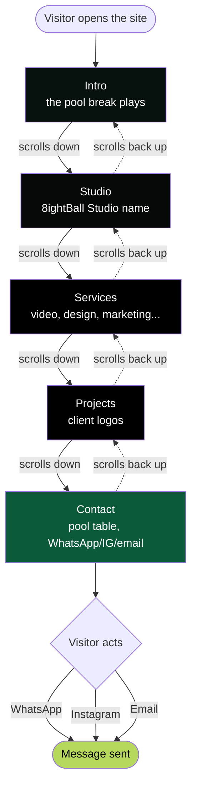

# Visitor Flow — 8 Ball Studio

How a visitor moves through the site's five Pages.

## The five Pages

| # | Page | What's there |
|---|---|---|
| 1 | **Intro** | The pool break animation plays once |
| 2 | **Studio** | The studio name, held on screen |
| 3 | **Services** | What the studio offers, one panel per service |
| 4 | **Projects** | Client logos |
| 5 | **Contact** | WhatsApp, Instagram, email — on a pool table background |

Scrolling down moves forward one Page at a time. Scrolling back up retraces the same order, except
Studio → Intro needs a deliberate upward swipe (so a stray scroll doesn't replay the break).
